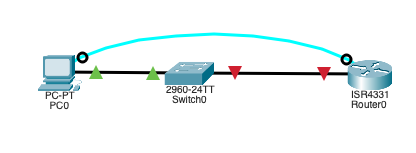
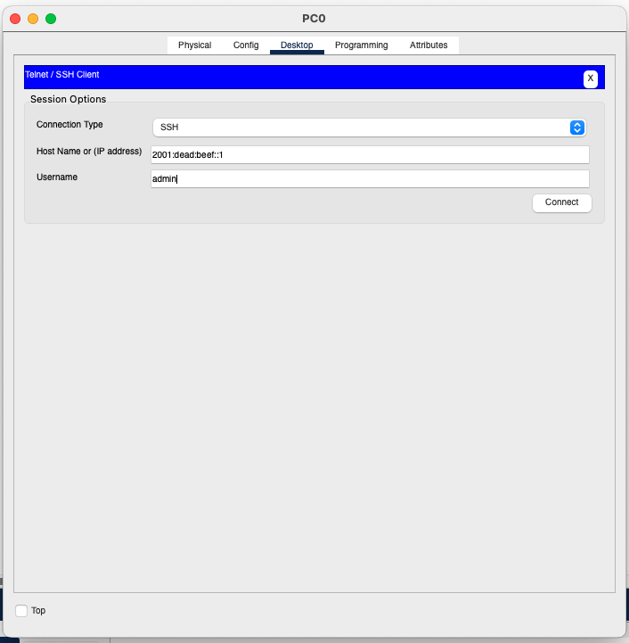

## Initial setup

Previously we have configured switch to be accessible from the PC, now we will add a router. For this tutorial I have picked the 4331 router.

- Connect the PC to the router using serial cable, from RS-232 port to the Console.
- Connect the router to the switch using straight-through cable

## Configure the router

Open the Terminal app on the PC, connect to the router

- Deny the default configuration using `no`
- Go to the en environment: `en`
- Enter global configuration mode: `conf t`
- Disable DNS lookups: `no ip domain-lookup`
- Set the hostname to "Router-1": `hostname Router-1`
- Enable password encryption for security: `service password-encryption`
- Set the secret password for privileged mode to "cisco": `enable secret cisco`
- Enter GigabitEthernet 0/0/0 interface configuration mode: `interface g0/0/0`
- Assign the IPv4 address "10.0.0.1" with a subnet mask of "255.255.255.0" to the interface: `ip address 10.0.0.1 255.255.255.0`
- Assign the IPv6 address "2001:dead:beef::1/64" to the interface: `ipv6 address 2001:dead:beef::1/64`
- Add the IPv6 link-local address to the interface as well: `ipv6 address fe80::1 link-local`
- Enable the interface: `no shutdown`
- Exit GigabitEthernet 0/0/0 interface configuration mode: `exit`
- Set the domain name to "cisco.ptk": `ip domain-name cisco.ptk`
- Generate an RSA key pair for secure communication with a key size of 1024 bits: `crypto key generate rsa`, than tell it to generate `1024` bit long key
- Create a username "admin" with the password "cisco": `username admin password cisco`
- Change the SSH version to 2: `ip ssh version 2`
- Configure VTY (telnet/SSH) access password to "cisco": `line vty 0 15`, `password cisco`
- Exit VTY configuration mode: `exit`, then exit again from the config
- Save the current configuration to the startup configuration file for persistence: `copy running-config startup-config`

Now you can open the Telnet/SSH Client and connect to the router using the 10.0.0.1 address, or the 2001:dead:beef::1 address.

Use the `cisco` password when prompted to login.