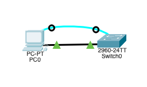
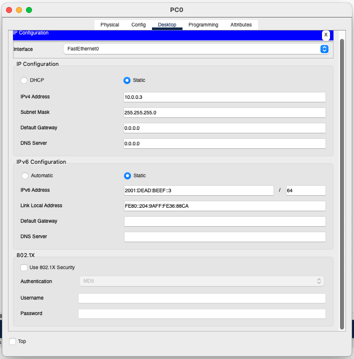
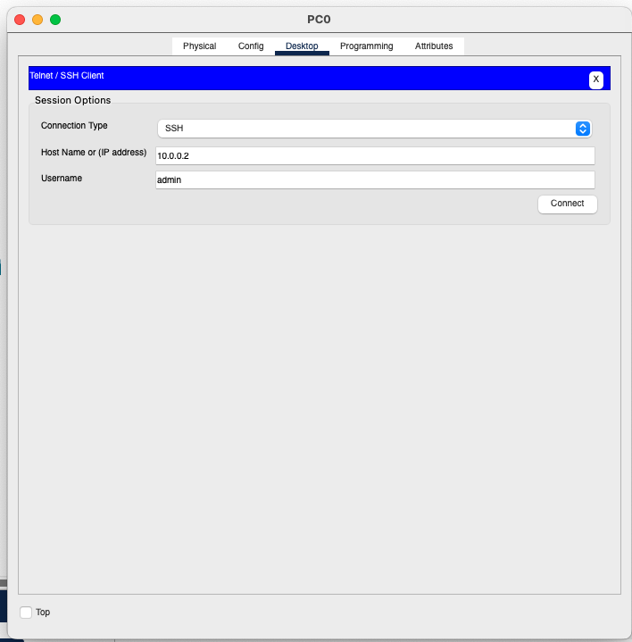

## Initial setup

- Pick a switch you would like to configure, this tutorial is going to use 2960
- Pick a PC and place it down
- Connect the PC and 2960 using serial cable, from RS-232 to Console
- Connect the PC and 2960 using straight-through cable

## Prepare the PC

- Open the PC, enter its IP configuration and fill in local network parameters

- Close the IP configuration, open Terminal app and connect

## Switch configuration

We will now configure the switch to be accessible via SSH on the 10.0.0.2 IP address

- Go to the en environment: `en`
- Enter global configuration mode: `config t`
- Disable DNS lookups: `no ip domain-lookup`
- Set the hostname to "Switch-1": `hostname Switch-1`
- Enable password encryption for security: `service password-encryption`
- Set the secret password for privileged mode to "cisco": `enable secret cisco`
- Enter VLAN 1 interface configuration mode: `interface vlan1`
- Assign the IP address "10.0.0.2" with a subnet mask of "255.255.255.0" to VLAN 1: `ip address 10.0.0.2 255.255.255.0`
- Enable VLAN 1 interface: `no shutdown`
- Exit VLAN 1 interface configuration mode: `exit`
- Set the domain name to "cisco.ptk": `ip domain-name cisco.ptk`
- Generate an RSA key pair for secure communication with a key size of 1024 bits: `crypto key generate rsa`, than tell it to generate `1024` bit long key
- Create a username "admin" with the password "cisco": `username admin password cisco`
- Change the SSH version to 2: `ip ssh version 2`
- Configure VTY (telnet/SSH) access password to "cisco": `line vty 0 15`, `password cisco`
- Exit VTY configuration mode: `exit`, then exit again from the config
- Save the current configuration to the startup configuration file for persistence: `copy running-config startup-config`

Now you can open the Telnet/SSH Client and connect to the switch.

When prompted for password, enter `cisco`