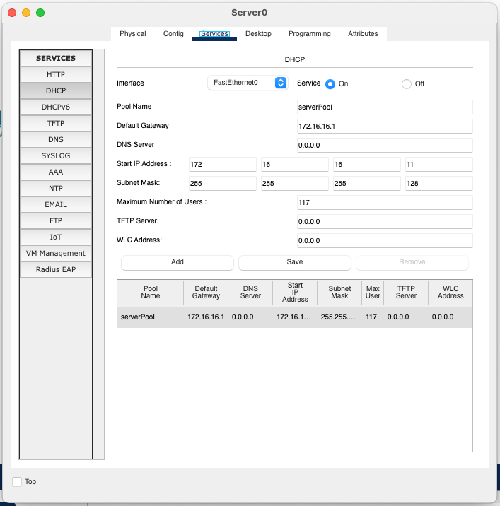
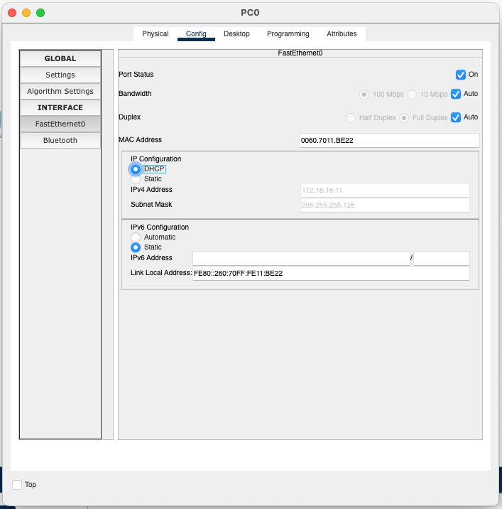
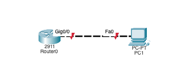

# DHCP Configuration

## Contents

In all examples, we are going to be creating a DHCP pool with the following parameters:
- Network address: `172.16.16.0` with a subnet mask of `/25` (`255.255.255.128`)
- Default gateway: `172.16.16.1`
- Reserved addresses: `172.16.16.1-10`

## Option 1: DHCP Server on Server

### Network layout

### Server configuration
- Open the Server configuration
- We will start by configuring the **network** interface:
  - Click on the `Config` tab
  - Click on the `Network` tab
  - Click on the `Edit` button
  - Set the IP address to `172.16.16.1`
  - Set the subnet mask to `255.255.255.128`
- **DHCP** is a service, therefore we will open the **Services** tab
  - Click on the DHCP service
  - There are multiple fields to fill in:
    - We will work with the default `serverPool` DHCP pool
    - Set the default gateway address: `172.16.16.1` - this is the default gateway for the clients
    - Start IP address: `172.16.16.11` - this is the first IP address that will be assigned to the client
    - Subnet mask: `255.255.255.128` - this is the subnet mask
    - We can leave the rest of the fields with their default values
    - Turn the DHCP service on by clicking on the `On` button
    - Click on the `Save` button to apply the changes to the pool
    
- The DHCP server is now ready to serve the clients

### PC configuration

- Open the PC configuration and set the IP address to `DHCP`
  - The PC should receive the IP address `172.16.16.11`
  
And you are done! It is that simple.

## Option 2: DHCP Server on Router

### Network layout

### Router configuration
- Open the Router CLI tab
- Enter the en environment: `en`
- Enter global configuration mode: `conf t`
- Disable DNS lookups: `no ip domain-lookup`
- Set the hostname to "Router-1": `hostname Router-1`
- We will set up the network interface first:
  - Enter the interface configuration mode: `interface g0/0`
  - Assign the IPv4 address: `ip address 172.16.16.1 255.255.255.128`
  - Enable the interface: `no shutdown`
  - Exit the interface configuration mode: `exit`
- We will now set up the DHCP pool:
  - Enter the DHCP configuration mode: `ip dhcp pool DHCP_POOL`
  - Set the default gateway: `default-router 172.16.16.1`ß
  - Set the network address: `network 172.16.16.0 255.255.255.128`
  - Set the domain name: `domain-name dhcp.local`
  - Exit the pool configuration mode: `exit`
  - Set the reserved addresses: `ip dhcp excluded-address 172.16.16.1 172.16.16.10`

### PC configuration
- Open the PC configuration and set the IP address to `DHCP`
  - The PC should receive the IP address `172.16.16.11`
    - Sometimes the PC might not receive the IP address immediately, you might need to wait a few seconds for the DHCP service to be brought up, then refresh the IP address (set the configuration to Static and then back to DHCP)
  

## Option 3: DHCP Server on Switch

The configuration is the same as for the Router.

### Final PKT File
