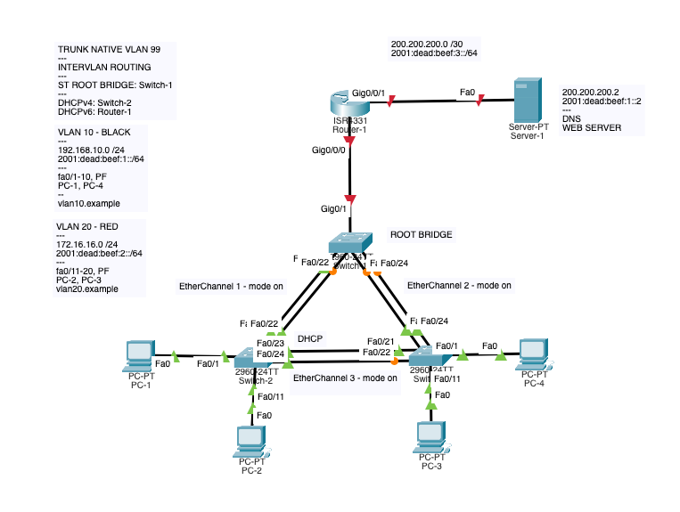
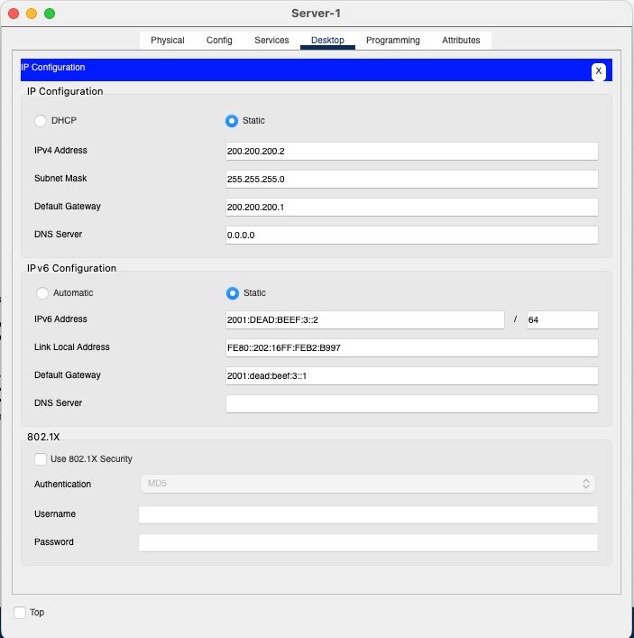

# DHCPv4 + DHCPv6, DNS, EtherChannel, Trunks, InterVLAN | Holy shit its all the things we have done so far

(Feel free to use Command+F as this is a long one lol)

## Assignment analysis
Imagine you are doing your graduation test and you get a pretty complex assignment:

Our network is going to have the following layout:

We are supposed to configure the following features:
- EtherChannel between the switches, with Root Bridge on Switch-1
- 2 separate VLANSs, each with own network, domain and DHCP
- InterVLAN routing
- IPv4 DHCP on Switch-2
- IPv6 DHCP on Router-1
- DNS on Server-1
- Web server on Server-1

### Action plan
When working on a complex problem such as this one, it is good to have an action plan and do things in systematic order.
Given the current problem, we will **start with easy things that do not depend on other features** and work our way up to more complex things that require lower level features to be already in working state.

**THE PLAN:**
1) Prepare Switches and router with basic setup (hostnames, no ip domain-lookup). This way we will not have to do this later...
2) Setup VLANs on the switches.
3) Setup EtherChannel, as it does not depend on anything else but itself.
4) Setup Trunks.
5) Setup InterVLAN routing.
6) Setup Server-Router connection.
7) Setup Server-1 with interface configuration, DNS and Web server.
8) Setup DHCP on Switch-2.
9) Setup DHCPv6 on Router-1.
10) Connect the PCs and test the network.

**OPTIONAL (and not mentioned in this tutorial):**
10) Secure the switches and router. (Why is this last? Because it would possibly slow us down during the configuration process.)
11) Setup SSH on the switches and router.

This way each time we will be configuring new feature, it will work right away without having to wait for us to set up some underlying feature.

## Execution

### 1) Prepare Switches and router with basic setup
- Open the Switch-1, enter the CLI
- Enter the en environment: `en`
- Enter global configuration mode: `conf t`
- Disable DNS lookups: `no ip domain-lookup`
- Set the hostname to "Switch-1": `hostname Switch-1`

--

- Open the Switch-2, enter the CLI
- Enter the en environment: `en`
- Enter global configuration mode: `conf t`
- Disable DNS lookups: `no ip domain-lookup`
- Set the hostname to "Switch-2": `hostname Switch-2`

--

- Open the Switch-3, enter the CLI
- Enter the en environment: `en`
- Enter global configuration mode: `conf t`
- Disable DNS lookups: `no ip domain-lookup`
- Set the hostname to "Switch-3": `hostname Switch-3`

--

- Open the Router-1, enter the CLI
- Enter the en environment: `en`
- Enter global configuration mode: `conf t`
- Disable DNS lookups: `no ip domain-lookup`
- Set the hostname to "Router-1": `hostname Router-1`

### 2) Setup VLANs on the switches
- Open the Switch-1 CLI (in config mode)
- Create VLAN 10: `vlan 10`
- Set the name of VLAN 10 to "BLACK": `name BLACK`
- Create VLAN 20: `vlan 20`
- Set the name of VLAN 20 to "RED": `name RED`
- Exit the VLAN configuration mode: `exit`
- Set the interface FastEthernet 0/1-10 to access VLAN 10: `interface range f0/1-10`, `switchport mode access`, `switchport access vlan 10`
- Enable PortFast on the interface FastEthernet 0/1-10: `spanning-tree portfast`
- Set the interface FastEthernet 0/11-20 to access VLAN 20: `interface range f0/11-20`, `switchport mode access`, `switchport access vlan 20`
- Enable PortFast on the interface FastEthernet 0/11-20: `spanning-tree portfast`
- We will not set the trunks yet as we need to set up the EtherChannel first.

--

- Open the Switch-2 CLI (in config mode)
- Create VLAN 10: `vlan 10`
- Set the name of VLAN 10 to "BLACK": `name BLACK`
- Create VLAN 20: `vlan 20`
- Set the name of VLAN 20 to "RED": `name RED`
- Exit the VLAN configuration mode: `exit`
- Set the interface FastEthernet 0/1-10 to access VLAN 10: `interface range f0/1-10`, `switchport mode access`, `switchport access vlan 10`
- Enable PortFast on the interface FastEthernet 0/1-10: `spanning-tree portfast`
- Set the interface FastEthernet 0/11-20 to access VLAN 20: `interface range f0/11-20`, `switchport mode access`, `switchport access vlan 20`
- Enable PortFast on the interface FastEthernet 0/11-20: `spanning-tree portfast`
- We will not set the trunks yet as we need to set up the EtherChannel first.

--

- Open the Switch-3 CLI (in config mode)
- Create VLAN 10: `vlan 10`
- Set the name of VLAN 10 to "BLACK": `name BLACK`
- Create VLAN 20: `vlan 20`
- Set the name of VLAN 20 to "RED": `name RED`
- Exit the VLAN configuration mode: `exit`
- Set the interface FastEthernet 0/1-10 to access VLAN 10: `interface range f0/1-10`, `switchport mode access`, `switchport access vlan 10`
- Enable PortFast on the interface FastEthernet 0/1-10: `spanning-tree portfast`
- Set the interface FastEthernet 0/11-20 to access VLAN 20: `interface range f0/11-20`, `switchport mode access`, `switchport access vlan 20`
-Enable PortFast on the interface FastEthernet 0/11-20: `spanning-tree portfast`
- We will not set the trunks yet as we need to set up the EtherChannel first.

### 3) Setup EtherChannel
- Open the Switch-1 CLI (in config mode)
- Enter the interface configuration mode for the first ether channel (1): `interface range f0/21-22`
- Set the channel mode to "on": `channel-group 1 mode on`
- Switch to the interface configuration mode for the other ether channel (2): `interface range f0/23-24`
- Set the channel mode to "on": `channel-group 2 mode on`
- Because this is the Root Bridge, we will set the priority to 0: `spanning-tree vlan 10 priority 0`
- We will set the priority to 0 for VLAN 20 as well: `spanning-tree vlan 20 priority 0`
- Set it up also for native VLAN: `spanning-tree vlan 99 priority 0`

--

- Open the Switch-2 CLI (in config mode)
- Enter the interface configuration mode for the first ether channel (1): `interface range f0/21-22`
- Set the channel mode to "on": `channel-group 1 mode on`
- Switch to the interface configuration mode for the other ether channel (3): `interface range f0/23-24`
- Set the channel mode to "on": `channel-group 3 mode on`

--

- Open the Switch-3 CLI (in config mode)
- Enter the interface configuration mode for the first ether channel (3): `interface range f0/21-22`
- Set the channel mode to "on": `channel-group 3 mode on`
- Switch to the interface configuration mode for the other ether channel (2): `interface range f0/23-24`
- Set the channel mode to "on": `channel-group 2 mode on`

### 4) Setup Trunks
- Open the Switch-1 CLI (in config mode)
- Enter the interface configuration mode for the channel group 1: `interface port-channel 1`
- Set the channel mode to "trunk": `switchport mode trunk`
- Set the allowed trunk VLANs: `switchport trunk allowed vlan 10,20,99`
- Exit the interface configuration mode: `exit`
- Enter the interface configuration mode for the channel group 2: `interface port-channel 2`
- Set the channel mode to "trunk": `switchport mode trunk`
- Set the allowed trunk VLANs: `switchport trunk allowed vlan 10,20,99`
- Enter the g0/1 interface configuration mode: `interface g0/1`
- Set the channel mode to "trunk": `switchport mode trunk`
- Set the native VLAN trunk: `switchport trunk native vlan 99`
- Exit the interface configuration mode: `exit`

--

- Open the Switch-2 CLI (in config mode)
- Enter the interface configuration mode for the channel group 1: `interface port-channel 1`
- Set the channel mode to "trunk": `switchport mode trunk`
- Set the allowed trunk VLANs: `switchport trunk allowed vlan 10,20,99`
- Exit the interface configuration mode: `exit`
- Enter the interface configuration mode for the channel group 3: `interface port-channel 3`
- Set the channel mode to "trunk": `switchport mode trunk`
- Set the allowed trunk VLANs: `switchport trunk allowed vlan 10,20,99`
- Exit the interface configuration mode: `exit`

--

- Open the Switch-3 CLI (in config mode)
- Enter the interface configuration mode for the channel group 2: `interface port-channel 2`
- Set the channel mode to "trunk": `switchport mode trunk`
- Set the allowed trunk VLANs: `switchport trunk allowed vlan 10,20,99`
- Exit the interface configuration mode: `exit`
- Enter the interface configuration mode for the channel group 3: `interface port-channel 3`
- Set the channel mode to "trunk": `switchport mode trunk`
- Set the allowed trunk VLANs: `switchport trunk allowed vlan 10,20,99`
- Exit the interface configuration mode: `exit`

### 5) Setup InterVLAN routing
- Open the Router CLI (in config mode)
- Enter the interface configuration mode for the interface g0/0: `interface g0/0/0` (connected to the Switch-1)
- Bring the interface up: `no shutdown`
- Go to the interface configuration mode for the subinterface g0/0/0.10: `interface g0/0/0.10`
- Set the encapsulation to "dot1q": `encapsulation dot1q 10`
- Set the IP address to `192.168.10.1` with a subnet mask of `/24`: `ip address 192.168.10.1 255.255.255.0`
- Also add the IPv6 address: `ipv6 address 2001:dead:beef:1::1/64`
- Exit the interface configuration mode: `exit`
- Go to the interface configuration mode for the subinterface g0/0/0.20: `interface g0/0/0.20`
- Set the encapsulation to "dot1q": `encapsulation dot1q 20`
- Set the IP address to `172.16.16.1` with a subnet mask of `/24`: `ip address 172.16.16.1 255.255.255.0`
- Also add the IPv6 address: `ipv6 address 2001:dead:beef:2::1/64`

### 6) Setup Server-Router connection
- Open the Router CLI (in config mode)
- Enter the interface configuration mode for the interface g0/0/1: `interface g0/0/1` (connected to the Server-1)
- Bring the interface up: `no shutdown`
- Set the IP address to `200.200.200.1` with a subnet mask of `/30`: `ip address 200.200.200.1 255.255.255.252`
- Also add the IPv6 address: `ipv6 address 2001:dead:beef:3::1/64`

### 7) Setup Server-1 with interface configuration, DNS and Web server
- Start by configuring the network interface, add IPv4 and IPv6 addresses:
  - 
- Configure the DNS service:
  - Add A Record for the IPv4 pointing to the server itself (the server will be running the Web Server as well)
  - Add AAAA Record for the IPv6
  - 
  - The Web Server should be already running by default (HTTP service)

### 8) Setup DHCP on Switch-2
- Open the Switch-2 CLI (in config mode)
- Enter the DHCP configuration mode: `ip dhcp pool DHCPv4-VLAN10`
- Set the default gateway: `default-router 192.168.10.1`
- Set the network address: `network 192.168.10.0 255.255.255.0`
- Set the DNS server: `dns-server 200.200.200.2`
- Set the domain name: `domain-name vlan10.example`
- Enter the DHCP configuration mode: `ip dhcp pool DHCPv4-VLAN20`
- Set the default gateway: `default-router 172.16.16.1`
- Set the network address: `network 172.16.16.0 255.255.255.0`
- Set the DNS server: `dns-server 200.200.200.2`
- Set the domain name: `domain-name vlan20.example`
- Exit the pool configuration mode: `exit`
- Set the reserved addresses: `ip dhcp excluded-address 192.168.10.1 192.168.10.10` and `ip dhcp excluded-address 172.16.16.1 172.16.16.10`
- We also need to add IPs to the VLAN interfaces, so that the DHCP server can be reached:
  - `interface vlan 10`, `ip address 192.168.10.2 255.255.255.0`
  - `interface vlan 20`, `ip address 172.16.16.2 255.255.255.0`

### 9) Setup DHCPv6 on Router-1
- Open the Router-1 CLI (in config mode)
- Enter the DHCP configuration mode: `ipv6 dhcp pool DHCPv6-VLAN10`
- Set the network address: `address prefix 2001:dead:beef:1::/64`
- Set the DNS server: `dns-server 2001:dead:beef:3::2`
- Set the domain name: `domain-name vlan10.example`
- Enter the DHCP configuration mode: `ipv6 dhcp pool DHCPv6-VLAN20`
- Set the network address: `address prefix 2001:dead:beef:2::/64`
- Set the DNS server: `dns-server 2001:dead:beef:3::2`
- Set the domain name: `domain-name vlan20.example`
- Exit the pool configuration mode: `exit`
- Enable the DHCPv6 server on the interface g0/0/0.10: `interface g0/0/0.10`, `ipv6 dhcp server IPv6-VLAN10`, `ipv6 nd other-config-flag`
- Enable the DHCPv6 server on the interface g0/0/0.20: `interface g0/0/0.20`, `ipv6 dhcp server IPv6-VLAN10`, `ipv6 nd other-config-flag`
- Set up Unicast Routing: `ipv6 unicast-routing`

### 10) Connect the PCs and test the network
- For each PC, set the IP address in the interface configuration to `DHCP`
- Both IPv4 and IPv6 should be assigned automatically, including DNS servers

And you are done! Optionally, you can secure the switches and router, as well as set up SSH.

### Final Packet Tracer file
[Download the final Packet Tracer file](./pkt_files/complex.pkt) (save as)