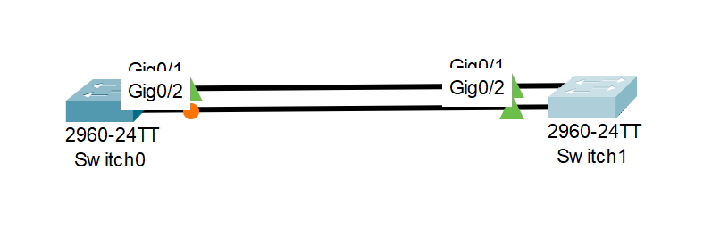
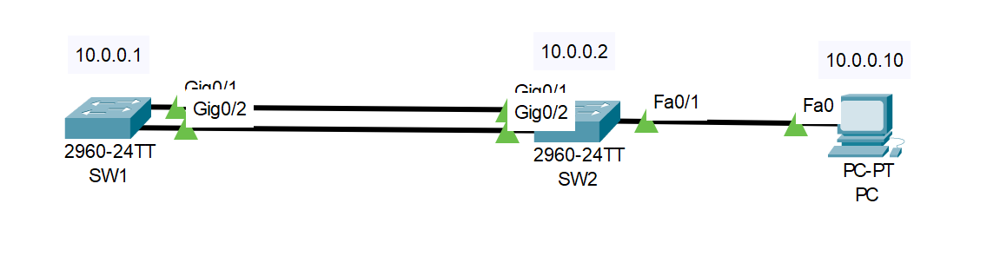

# EtherChannel in a nutshell
EtherChannel is a link aggregation technology primarly used on Cisco switches that allows several physical Ethernet links to create one logical Ethernet link.
Main purpose is fault tolerance and high bandwidth.

By default if you create multiple links between devices STP kicks in and disables redundant connections.


Both ends must be configured with the same VLANs, duplex modes and speeds.

> **Note:** Both end devices must have the same channel group number.

## Protocols
There are two protocols that we need to know about **PAgP** and **LACP**.

Every protocol has it's own modes that determin the behaviour.

### PAgP
_Port Aggregation Protocol_ is Cisco proprietary which means that only Cisco devices understand it.

|Mode|Description|
|-|-|
|on|Forces establishment of EtherChannel without negotiation|
|desirable|Negotiates establishment of EtherChannel|
|auto|Only establishes EtherChannel if the other device asked for it|

### LACP
_Link Aggregation Control Protocol_ is an open protocol which makes it usable across different device vendors.

|Mode|Description|
|-|-|
|on|Forces establishment of EtherChannel without negotiation|
|active|Tries to negotiate establishment of EtherChannel|
|passive|Only establishes EtherChannel if the other device asked for it|

## Configuration
- In this example our network address IP is `10.0.0.0/24`.

### PC configuration
- The PC will have a static IP address `10.0.0.10`

### Switch configuration
- Switches are connected to each other on ports `g0/1-2`
- PC is connected to `f0/1`
- We will use [LACP](#lacp) protocol

#### Switch 1

##### Prepare the switch
Set the hostname, disable domain lookup, etc
```
en
conf t
no ip domain-lookup
hostname SW1
```
##### Configure interfaces
Set channel group and mode
```
int range g0/1-2
channel-group 1 mode active
```
This creates a new virtual interface.

##### Pass VLANs
```
interface port-channel 1
switchport mode trunk
switchport trunk allowed vlan 1
```

##### Configure switch IP address
```
int vlan 1
ip address 10.0.0.1 255.255.255.0
no shutdown
```

#### Switch 2

##### Prepare the switch
Set the hostname, disable domain lookup, etc
```
en
conf t
no ip domain-lookup
hostname SW2
```
##### Configure interfaces
Set channel group and mode.
```
int range g0/1-2
channel-group 1 mode active
```
This creates a new virtual interface.

##### Pass VLANs
```
interface port-channel 1
switchport mode trunk
switchport trunk allowed vlan 1
```

##### Configure switch IP address
```
int vlan 1
ip address 10.0.0.2 255.255.255.0
no shutdown
```

##### Configure shitch port for PC
```
int f0/1
switchport mode access
switchport access vlan 1
```

### Result


All ports on both ends of the ether channel should light up green (change status to up)

Now you should be able to ping both swithes.

PKT file: [etherchannel.pkt](./pkt_files/etherchannel.pkt)