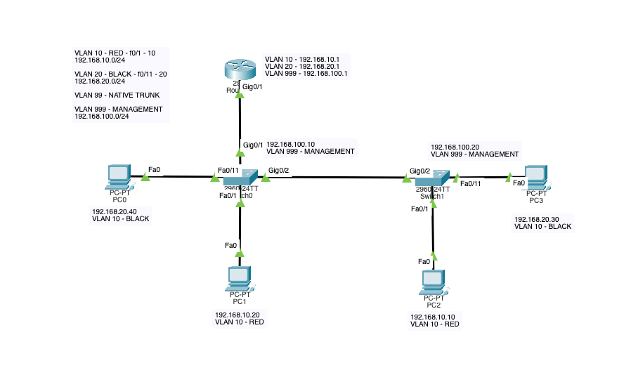

# InterVLAN Routing Tutorial
## Initial setup
We are going to start by preparing the physical layout of the network. In this example network, the topology is following:

## Configure the PCs
 - For each of the PC, open its IP configuration and fill in the IP address and mask
 - We will also need to include the default gateway IP, as we are going to be using router:
   - PC1, PC2 are in the RED VLAN, so the default gateway will be `192.168.10.1`
   - PC3, PC4 are in the BLACK VLAN, so the default gateway will be `192.168.10.2`

## Configure the switches

### Switch 1
Next we will configure the switches. You do not need a console cable, you can simply click on the switch, select the CLI tab and terminal will open.

**Prepare the general stuff:**

 - Go to the en environment: `en`
 - Enter global configuration mode: `conf t`
 - Disable DNS lookups: `no ip domain-lookup`
 - Set the hostname to "Switch-1": `hostname Switch-1`
 - Enable password encryption for security: `service password-encryption`
 - Set enable password to "cisco": `enable password cisco`

**Next we will configure the VLANs for Switch 1.** These are specific to the task. In this example, we will be configuring the FastEthernet interfaces 1-10 to VLAN 10, 11-20 to VLAN 20.

 - Create the VLANs and add names to them. The names are not required, but they are useful for clarity.
   - Create VLAN 10: `vlan 10`
   - Set the name of VLAN 10 to "RED": `name RED`
   - Create VLAN 20: `vlan 20`
   - Set the name of VLAN 20 to "BLACK": `name BLACK`
   - Create management VLAN 999: `vlan 999`
   - Set the name of VLAN 999 to "MANAGEMENT": `name MANAGEMENT`
   - Add interfaces to the VLAN 10: `interface range f0/1 - 10`, `switchport mode access`, `switchport access vlan 10`
   - Add interfaces to the VLAN 20: `interface range f0/11 - 20`, `switchport mode access`, `switchport access vlan 20`

**Next we will configure the trunks.** These ports will be used to connect the switch to the router and second switch. The trunk ports will be used to carry traffic from all VLANs.

   - Configure the trunk ports: `interface range g0/1-2`, `switchport mode trunk`, `switchport trunk native vlan 99`
   - Exit the configuration mode for the interfaces: `exit`

**Next we will configure the management VLAN.** This VLAN will be used to access the switch remotely.
    - Configure the management VLAN: `interface vlan 999`, `ip address 192.168.100.10 255.255.255.0`, `no shutdown`
    - Exit the configuration mode for the interfaces: `exit`

**Next we will configure the default gateway.** This will be the IP address of the router.
     - Configure the default gateway: `ip default-gateway 192.168.100.1`

**Next we will configure the SSH access.** This will allow us to connect to the switch remotely.

   - Add the Switch to the domain: `ip domain-name cisco.ptk`
   - Generate an RSA key pair for secure communication with a key size of 1024 bits: `crypto key generate rsa`, than tell it to generate `1024` bit long key
   - Create a username "admin" with the password "cisco": `username admin password cisco`
   - Change the SSH version to 2: `ip ssh version 2`
   - Configure VTY (telnet/SSH) access password to "cisco": `line vty 0 15`, `transport input ssh`, `login local`
   - Exit VTY configuration mode: `exit`, then exit again from the config
   - Save the current configuration to the startup configuration file for persistence: `copy running-config startup-config`

### Switch 2
Open the CLI for Switch-2. The configuration will be similar to the Switch-1.

- Go to the en environment: `en`
- Enter global configuration mode: `conf t`
- Disable DNS lookups: `no ip domain-lookup`
- Set the hostname to "Switch-2": `hostname Switch-2`
- Enable password encryption for security: `service password-encryption`
- Set enable password to "cisco": `enable password cisco`
- Create VLAN 10: `vlan 10`
- Set the name of VLAN 10 to "RED": `name RED`
- Create VLAN 20: `vlan 20`
- Set the name of VLAN 20 to "BLACK": `name BLACK`
- Create management VLAN 999: `vlan 999`
- Set the name of VLAN 999 to "MANAGEMENT": `name MANAGEMENT`
- Add interfaces to the VLAN 10: `interface range f0/1 - 10`, `switchport mode access`, `switchport access vlan 10`
- Add interfaces to the VLAN 20: `interface range f0/11 - 20`, `switchport mode access`, `switchport access vlan 20`
- Configure the trunk port: `interface g0/2`, `switchport mode trunk`, `switchport trunk native vlan 99`
- Configure the management VLAN: `interface vlan 999`, `ip address 192.168.100.20 255.255.255.0`, `no shutdown`
- Configure the default gateway: `ip default-gateway 192.168.100.1`
- Add the Switch to the domain: `ip domain-name cisco.ptk`
- Generate an RSA key pair for secure communication with a key size of 1024 bits: `crypto key generate rsa`, than tell it to generate `1024` bit long key
- Create a username "admin" with the password "cisco": `username admin password cisco`
- Change the SSH version to 2: `ip ssh version 2`
- Configure VTY (telnet/SSH) access password to "cisco": `line vty 0 15`, `transport input ssh`, `login local`
- Exit VTY configuration mode: `exit`, then exit again from the config
- Save the current configuration to the startup configuration file for persistence: `copy running-config startup-config`

## Configure the router

### Initial setup

- Go to the en environment: `en`
- Enter global configuration mode: `conf t`
- Disable DNS lookups: `no ip domain-lookup`
- Set the hostname to "Router-1": `hostname Router-1`
- Enable password encryption for security: `service password-encryption`
- Set the secret password for privileged mode to "cisco": `enable secret cisco`

### Configure the interfaces

Now we will configure the interfaces for InterVLAN routing. There should be the Switch-1 connected to the G0/1.

- Enter GigabitEthernet 0/1 interface configuration mode: `interface g0/1` (Please, note, that the interface name might be different depending on the hardware you chose. You can find all interface names by exiting the config and in using en mode `show ip interface brief`)
- Put the interface into no shutdown mode: `no shutdown`

Now we will configure the subinterfaces for the VLANs. The subinterfaces will be used to route the traffic between the VLANs.

- Create subinterface for VLAN 10: `interface g0/1.10`
- Set the encapsulation to 802.1Q: `encapsulation dot1Q 10`
- Assign the IPv4 address "192.168.10.1": `ip address 192.168.10.1 255.255.255.0`
- Enable the interface: `no shutdown`
- Create subinterface for VLAN 20: `interface g0/1.20`
- Set the encapsulation to 802.1Q: `encapsulation dot1Q 20`
- Assign the IPv4 address "192.168.20.1": `ip address 192.168.20.1 255.255.255.0`
- Enable the interface: `no shutdown`
- Create subinterface for VLAN 999: `interface g0/1.999`
- Set the encapsulation to 802.1Q: `encapsulation dot1Q 999`
- Assign the IPv4 address "192.168.100.1": `ip address 192.168.100.1 255.255.255.0`
- Enable the interface: `no shutdown`
- Exit GigabitEthernet 0/1 interface configuration mode: `exit`

### Enable SSH access

Now we will configure the SSH access. This will allow us to connect to the router remotely.

- Add the Router to the domain: `ip domain-name cisco.ptk`
- Generate an RSA key pair for secure communication with a key size of 1024 bits: `crypto key generate rsa`, than tell it to generate `1024` bit long key
- Create a username "admin" with the password "cisco": `username admin password cisco`
- Change the SSH version to 2: `ip ssh version 2`
- Configure VTY (telnet/SSH) access password to "cisco": `line vty 0 15`, `transport input ssh`, `login local`
- Exit VTY configuration mode: `exit`, then exit again from the config
- Save the current configuration to the startup configuration file for persistence: `copy running-config startup-config`

## Test the network

- Now you can try pinging the PC1 from PC2. The ping should be successful. You can also try pinging the PC3 from PC4. The ping should be successful as well.
- You can also try pinging the PC1 from PC3. The ping should be also successful, as the router is routing the traffic between the VLANs.
- From any PC, try to connect to any of the switches or the router using SSH. The connection should be successful.

## Final PKT file
You can download the final PKT file here: [intervlan_network.pkt](./pkt_files/intervlan_network.pkt)