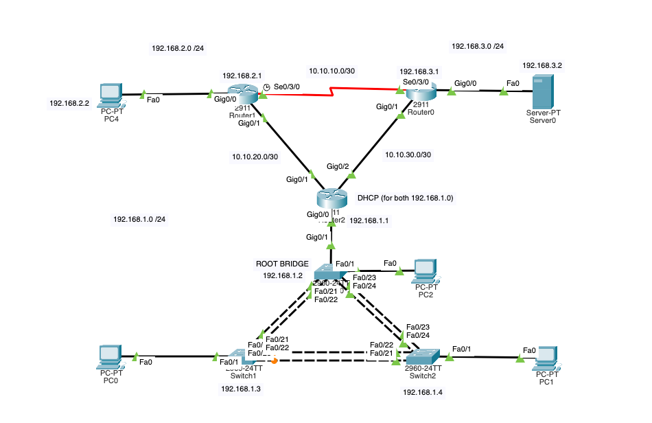
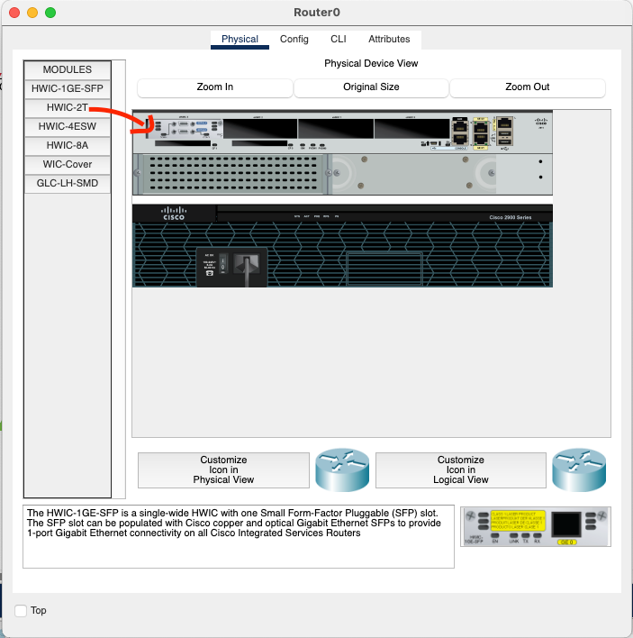

# OSPF, PortSecurity, Ether Channel, DHCP

Things that were explained in the previous tutorials will be shortened to a minimum in this one. If you are not sure about something, please refer to the previous tutorials.

## Network topology

The network will look like this:

Please, note the serial connection on the top. To be able to use the serial, we have to add new module to the routers.
Open the router menu, **shut down** the router, go to `Physical` and drag the serial module (`WIC-2T`) to the first available slot. After that, **power on** the router.

Repeat for the second router.

That is it for the layout.

## EtherChannel
We will start with the easy part, EtherChannel.

### Switch 0
- Go to privileged exec mode: `en`
- Go to the global configuration mode: `conf t`
- First disable domain lookup: `no ip domain-lookup`
- Set the hostname to `S0`: `hostname S0`

Now comes the EtherChannel.
- Go to the interface configuration mode for the first port: `interface range f0/21-22`
- Set the channel group to 1: `channel-group 1 mode on`
- Enter the second interface pair: `interface range f0/23-24`
- Set the channel group to 2: `channel-group 2 mode on`
- As we want S0 to be the root bridge, we have to set the priority to the lowest possible value: `spanning-tree vlan 1 priority 0`
- Exit the interface configuration mode: `exit`

We will also be able to use the SSH on the switch, so we will set it up.
- Generate RSA key pair: `crypto key generate rsa`, then tell it to generate `2048` bit long key
- Create a username `admin` with the password `cisco`: `username admin password cisco`
- Set the SSH version to 2: `ip ssh version 2`
- Configure VTY access: `line vty 0 15`, `transport input ssh`, `login local`
- Exit the VTY configuration mode: `exit`
- We will also need static IP address for the switch: `interface vlan1`, `ip address 192.168.1.2 255.255.255.0`
- Enable the interface: `no shutdown`

That is all. **Repeat for the other switches, you can omit the root bridge part.**

## Router Configuration

### Router 2

- Go to privileged exec mode: `en`
- Go to the global configuration mode: `conf t`
- First disable domain lookup: `no ip domain-lookup`
- Set the hostname to `R2`: `hostname R2`

Start by configuring all the interfaces with IP addresses.
- Configure the GigabitEthernet interface: `interface g0/0`, `ip address 192.168.1.1`, `no shutdown`
- Configure g0/1 interface: `interface g0/1`, `ip address 10.10.20.2 255.255.255.252`, `no shutdown`
- Configure g0/2 interface: `interface g0/2`, `ip address 10.10.30.2 255.255.255.252`, `no shutdown`

Now we will configure DHCP.
- Prepare the excluded addresses: `ip dhcp excluded-address 192.168.1.1 192.168.1.10`
- Go to the DHCP configuration mode: `ip dhcp pool POOL-1`
- Set the network to `192.168.1.0 255.255.255.0`
- Set the default router to `192.168.1.1` (itself)
- Exit the DHCP configuration mode: `exit`

Prepare the interfaces of all the other routers as well.

For the serial interfaces, it will be also required to set clock rate on one side of the link:
- Go to the serial interface configuration mode: `interface s0/3/0`
- Set the clock rate: `clock rate 128000`
- Configure IP address: `ip address 10.10.10.1 255.255.255.252`
- Enable the interface: `no shutdown`
- Exit the interface configuration mode: `exit`

The rest is standard configuration as in many previous tutorials.

## OSPF

### Router 2

- Go to the global configuration mode: `conf t`
- Start OSPF configuration: `router ospf 1`
- Set the router ID: `router-id 2.2.2.2` - the router ID has to be unique, looks like an IP address, but it is not the actual IP
- Configure OSPF interfaces - for all the interfaces that will pariticpate in OSPF, add the interface network address with wildcard mask:
  - `network 192.168.1.0 0.0.0.255 area 0` - area 0 is the backbone area, we could use any number, but 0 is the simplest we can do now
  - `network 10.10.20.0 0.0.0.2 area 0`
  - `network 10.10.30.0 0.0.0.2 area 0`

**Repeat for the other routers**. They will automatically negotiate the OSPF configuration and routes will be exchanged.

## Port Security

We will now finish with a simple port security configuration on the switches.

### Switch 0

- Go to the global configuration mode: `conf t`
- Go to the interface configuration mode: `interface f0/1`
- Enable port security: `switchport port-security`
- Set the maximum number of MAC addresses to 1: `switchport port-security maximum 1` - this will allow 1 MAC address maximum on the port
- Set the violation mode to restrict: `switchport port-security violation restrict` - this will disable the port if the violation occurs
- We will also set the MAC address to sticky - therefore the first connected device will be linked to the port and no other will be able to connect to it: `switchport port-security mac-address sticky`

Repeat this step for the other interfaces that are ON and that you want to secure.

Disable the unused interfaces:
- Go to the interface configuration mode: `interface range f0/2-20`
- Disable the interfaces: `shutdown`
- Exit the interface configuration mode: `exit`

That is all for this tutorial. You can now test the network and see if everything is working as expected, ping across the networks etc.

You can download the final PKT file: [here](./pkt_files/OSPF.pkt)