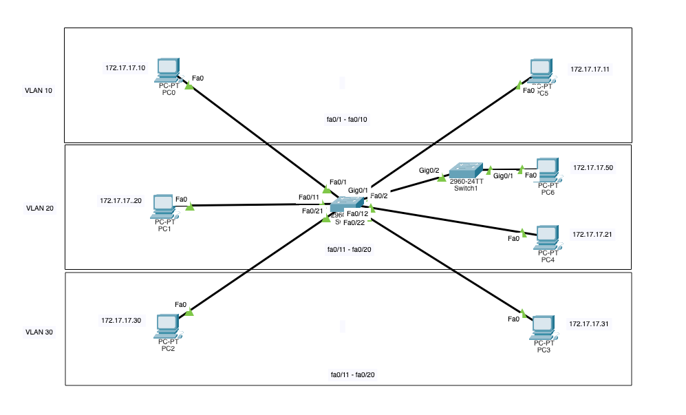

## Initial setup

We are going to start by preparing the physical layout of the network. In this example network, the topology is following:

- 3 VLANs, VLAN 10 (interfaces Fa0/1-10), VLAN 20 (interfaces Fa0/11-20) and VLAN 30 (interfaces Fa0/21-24)
- 2 PCs in each VLAN
- VLAN 20 will have a second switch with PC connected to it

*(The boxes, labels etc. are just for clarity, they are not required.)*

Pay extra attention to the port names on the switches. The connection should be made using the ports in the appropriate VLANs. For example, in this example we want PC1 to be connected to VLAN 20, which will be assigned to interfaces FastEthernet 0/11 - 20 on the switch, therefore we have to connect the PC to one of those ports (for example Fa0/11). You can see the example below for more info.



## Configure the PCs

 - For each of the PC, open its IP configuration and fill in the IP address and mask

## Configure the switches

Next we will configure the switches. You do not need a console cable, you can simply click on the switch, select the CLI tab and terminal will open.

**Prepare the general stuff:**

- Go to the en environment: `en`
- Enter global configuration mode: `conf t`
- Disable DNS lookups: `no ip domain-lookup`
- Set the hostname to "Switch-1": `hostname Switch-1`

**Next we will configure the VLANs for Switch 1.** These are specific to the task. In this example, we will be configuring the FastEthernet interfaces 1-10 to VLAN 10, 11-20 to VLAN 20 and 21-24 to VLAN 30.

*You might want to check the available interface names using `do show ip interface brief` command.*

*During the configuration, you can use `do show vlan` command to check the current VLAN configuration.*

Create the VLANs and add names to them. The names are not required, but they are useful for clarity.
- Create VLAN 10: `vlan 10`
- Set the name of VLAN 10 to "VLAN10": `name Studenti`
- Exit: `exit`
- Create VLAN 20: `vlan 20`
- Set the name of VLAN 20 to "VLAN20": `name Ucitele`
- Exit: `exit`
- Create VLAN 30: `vlan 30`
- Set the name of VLAN 30 to "VLAN30": `name Vedeni`
- Exit: `exit`

Configure the interfaces to be in access mode and assign them to the VLANs:

- Enter the configuration mode for interfaces FastEthernet 0/1 - FastEthernet 0/10: `interface range f0/0 - 10`
- Set the access mode for the interfaces: `switchport mode access`
- Set the VLAN for the interfaces to VLAN 10: `switchport access vlan 10`
- Switch to the configuration mode for interfaces FastEthernet 0/11 - FastEthernet 0/20: `interface range f0/11 - 20`
- Set the access mode for the interfaces: `switchport mode access`
- Set the VLAN for the interfaces to VLAN 20: `switchport access vlan 20`
- Switch to the configuration mode for interfaces FastEthernet 0/21 - FastEthernet 0/30: `interface range f0/21 - 24`
- Set the access mode for the interfaces: `switchport mode access`
- Set the VLAN for the interfaces to VLAN 30: `switchport access vlan 30`
- Exit the configuration mode for the interfaces: `exit`

The Switch-1 should be now ready to work. Try opening for example PC with IP `172.17.17.20` and try to ping the PC with IP `172.17.17.10`. The ping should be unsuccessful. Then try pinging `172.17.17.21` - this IP is in the same VLAN, so the ping should be successful.

On Switch 1, we will also prepare interface G0/1 to be in the VLAN 20. This interface will be connected to Switch 2.

- Enter the configuration mode for interface G0/1: `interface g0/1`
- Set the access mode for the interface: `switchport mode access`
- Set the VLAN for the interface to VLAN 20: `switchport access vlan 20`
- Exit the configuration mode for the interface: `exit`
- Exit the configuration mode: `exit`
- Save the configuration: `copy running-config startup-config`

**Next we will configure the VLANs for Switch 2.** There should be a PC connected on port G0/1, which will be in VLAN 20. The Switch 2 will be connected to Switch 1 using port G0/2 to G0/1.

- Go to the en environment: `en`
- Enter global configuration mode: `conf t`
- Disable DNS lookups: `no ip domain-lookup`
- Set the hostname to "Switch-2": `hostname Switch-2`
- Create VLAN 20: `vlan 20`
- Set the name of VLAN 20 to "VLAN20": `name Ucitele` (again, the name is just for clarity, can be whatever you like)
- Exit: `exit`

Now let's configure the interfaces and put them into appropriate VLAN. There should be a PC6 on interface G0/1 and Switch 1 on interface G0/2.

- Enter the configuration mode for interfaces G0/1-2: `interface range g0/1-2`
- Set the access mode for the interfaces: `switchport mode access`
- Set the VLAN for the interfaces to VLAN 20: `switchport access vlan 20`
- Exit the configuration mode for the interfaces: `exit`
- Exit the configuration mode: `exit`
- Save the configuration: `copy running-config startup-config`

With this, **the configuration should be done**. You can try pinging the PC6 from PC1. The ping should be successful.

You can also verify the configuration using `show vlan` command on each of the routers. The output for Switch 1 should look like:
```
VLAN Name                             Status    Ports
---- -------------------------------- --------- -------------------------------
1    default                          active    Gig0/2
10   student                          active    Fa0/1, Fa0/2, Fa0/3, Fa0/4
Fa0/5, Fa0/6, Fa0/7, Fa0/8
Fa0/9, Fa0/10
20   ucitel                           active    Fa0/11, Fa0/12, Fa0/13, Fa0/14
Fa0/15, Fa0/16, Fa0/17, Fa0/18
Fa0/19, Fa0/20, Gig0/1
30   vedeni                           active    Fa0/21, Fa0/22, Fa0/23, Fa0/24
1002 fddi-default                     active    
1003 token-ring-default               active    
1004 fddinet-default                  active    
1005 trnet-default                    active

VLAN Type  SAID       MTU   Parent RingNo BridgeNo Stp  BrdgMode Trans1 Trans2
---- ----- ---------- ----- ------ ------ -------- ---- -------- ------ ------
1    enet  100001     1500  -      -      -        -    -        0      0
10   enet  100010     1500  -      -      -        -    -        0      0
20   enet  100020     1500  -      -      -        -    -        0      0
30   enet  100030     1500  -      -      -        -    -        0      0
1002 fddi  101002     1500  -      -      -        -    -        0      0   
1003 tr    101003     1500  -      -      -        -    -        0      0   
1004 fdnet 101004     1500  -      -      -        ieee -        0      0   
1005 trnet 101005     1500  -      -      -        ibm  -        0      0

VLAN Type  SAID       MTU   Parent RingNo BridgeNo Stp  BrdgMode Trans1 Trans2
---- ----- ---------- ----- ------ ------ -------- ---- -------- ------ ------

Remote SPAN VLANs
------------------------------------------------------------------------------

Primary Secondary Type              Ports
------- --------- ----------------- ------------------------------------------
```

You can also download the [PKT file](./pkt_files/vlanky.pkt) and open it in Packet Tracer to see the configuration.